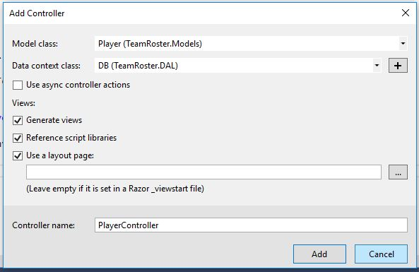

# MVC Code First with Entity Framework
In this demo, we will build a C# MVC website and use the entity framework to connect it to a local database. We will be using a standalone database known as “localdb”. In fact, it’s the same kind of database that is used by Microsoft SQL Server and can easily be moved to SQL server. Localdb is not as fast as SQL server, but it will work well for any small to medium websites. The major advantage of a localdb database is that it’s very portable. Any developer will be able to easily download and run a project that uses localdb since it doesn’t require the installation of SQL Server. Localdb is also good for development since every developer can run their own version of the database. This fact plus a feature in the Entity Framework called “Migrations” makes the development cycle easier to manage. 
There are basically 3 methods of creating an MVC project that uses the Entity Framework.
* **Code First** - The code drives the database construction and maintenance. Code first is usually used for new projects and is what is demonstrated in these instructions.
* **Database First** – The database drives the construction and maintenance of the code. (Typically used by existing application migrating to the Entity Framework) You can read more about this approach [here](http://www.c-sharpcorner.com/UploadFile/8ef97c/mvc-5-0-application-using-entity-framework-db-first-approach/).
* **Model First** – A database model drives the construction and maintenance of the database and code. This is more of a hybrid approach which allows you to work on your object design in a GUI and have the database and code flow from that GUI-based design. You can read more about this approach [here]( http://www.c-sharpcorner.com/UploadFile/4b0136/model-first-approach-in-Asp-Net-mvc-5/).
To demonstrate this we’ll be creating a sample application called “Team Roster” to track players and teams. We’ll start by creating the project.
### 1. Create the project
Choose File->New Project from the menu.

Select Visual C# and Web, then select ASP.NET Web Application, name your project and click “Add”.


Select MVC


Click "change authentication" Make sure authentication is set to no authentication


Click OK

### 2. Add the Entity Framework 
After the project is created you’ll need to add the Entity Framework. 
From the Tools menu select NuGet Package Manager->Package Manager Console.

In the Package Manager Console window enter the following command:

```Install-Package EntityFramework``` 

### 3. Add Your Models (Class files)
One of the best places to start designing an application that uses a database is your models (or classes). It’s a simple task that in the long term can be challenging to master. At the simplest level think about how to describe the data you need to collect as nouns. In this application, which is designed to keep track of a team roster we have nouns like:

- Team
- Player
- Coach

We’ll only be using Team and Player in our example, but you get the general idea. 

Once you have those nouns then start thinking about each field of data you want to track. So, for a player you would need data fields like first name, last name, and team. After you have reasonable list of models/classes and a list of fields you’re ready to create your classes.

One other thing to consider before you begin class creation is what code standards you’ll use. Code standards provide conventions that make your code easier to write and maintain. If you don’t already have a set of code standards here are some to get you started:
- All class names are singular and pascal case (each word is uppercase)
- All class and property names are nouns or compound nouns
- All method names are verbs
- All classes will contain an ID property. The ID property will be in the form of [CLASS NAME]_Id
- All method parameters are pascal case
- All local variables are camel case (first letter is lower case and every other word is capitalized)

If you want to dive a little deeper into coding standards here are a couple of great articles:

- [C# Coding Standards, Best Practices & Visual Studio Tips]( http://blog.aajtech.com/blog/c-coding-standards-best-practices-visual-studio-tips/) 
- [C# Coding Standards and Naming Conventions](http://www.dofactory.com/reference/csharp-coding-standards)

Now that we have a set of standards we’re ready to start creating our classes.

Right-click on the models folder and choose add->class:


Name your class and click save.

Add some using statements to the top of your class file (we’ll need these later) and populate your classes with as many properties as you need.
```
using System.ComponentModel.DataAnnotations;
using System.Collections;
```
At this point you should have some basic classes that look something like this:

```
using System;
using System.Collections.Generic;
using System.Linq;
using System.Web;
using System.ComponentModel.DataAnnotations;

namespace TeamRoster.Models
{
    public class Player
    {
        public int Player_Id { get; set; }

        public string FirstName { get; set; }

        public string LastName { get; set; }

        public DateTime DateAdded { get; set; } 
    }
}
```
```
using System;
using System.Collections;
using System.Collections.Generic;
using System.ComponentModel.DataAnnotations;
using System.Linq;
using System.Web;

namespace TeamRoster.Models
{
    public class Team
    {
        public int Team_Id { get; set; }

        public string TeamName { get; set; }
    }
}
```

Now that our classes are created, let’s consider the relationship between each class. By relationship I mean one of the following:

- One to One
- One to Many
- Many to Many

In our example, this means the relationships between team and player. We can describe the relationship between Team and Player as “One to Many” since a Team has many players. The relationship between Player and Team could be either “One to Many” or “One to One” depending on our business rules. For our example, we’ll assume that a player can only be a member of one team at a time, so that makes the relationship “One to One”. Now that we know about the relationship between our classes it’s time to add a property to each class to represent that relationship. 

For the One to One relationship between player and team we just need to add a property that represents the players team. We can do that like this:
```
public virtual Team PlayerTeam { get; set; }
```

It’s important that we use the “virtual” access modifier when adding a property that is a relationship between classes. The Entity Framework can work more efficiently when that access modifier is added. You can get more information about access modifiers from the [Microsoft website]( https://docs.microsoft.com/en-us/dotnet/csharp/language-reference/keywords/access-modifiers). 
By adding this property we’ve just tied to player to a single team. This type of property is also called a “navigation property” (if you were using a model first approach this property would be seen in the bottom of the class under “navigation” properties).
Now let’s handle the “One to Many” relationships between team and player. We do that by adding the following property to the team object:

```
public virtual ICollection<Player> Players { get; set; }
```
Take note of the pattern here, we’re using an ``ICollection`` which allows us to specify a ``type``. In our example that type is our class ``Player``. If we were defining a “Many to Many” relationship then we would be adding an ICollection property to each class. 

With our relationships defined, it’s time to add some data annotations.

Entity Framework requires is that we add a ``[Key]`` to our ``Id`` field so it knows which property is our unique ID for each class. In our example, however, we’re going to be doing a bit more work to control how Entity Framework creates our database. We’ll do that by adding some data annotations to our properties.
First, we need to add the Key data annotation. So above each of our Id properties we just add ``[Key]``
```
public class Player
{
    [Key]
    public int Player_Id { get; set; }
    ...	
```
```
public class Team
{
    [Key]
    public int Team_Id { get; set; }
    ...	
```
After the ``[Key]`` annotation is added, we could add a connection string, migrations and execute a command in Visual Studio and build our database. But we’re not doing that yet since we are going to add some additional annotations to make our database a little more efficient. 

If we built the database now, properties like “FirstName” and “LastName” will end up generating corresponding database columns that are bigger than we really need. Fortunately, some additional annotations allow us to control how Entity Framework creates those database columns. We won’t be using all the data annotations available, just some of the more common ones. (You can more about data annotations [here]( https://msdn.microsoft.com/en-us/library/jj591583%28v=vs.113%29.aspx?f=255&MSPPError=-2147217396)). 

The three that we will be focusing on are ``[Required]`` and ``[StringLength]`` and ``[DataType]``. The ``[Required]`` annotation and the ``[StringLength]`` annotation both allow us to specify an optional error message. “StringLength” also requires us to specify the maximum size of the string. So look over your classes and look for any property you’d like to make required and add the [Required] annotation to the property. (The ``[Key]`` field is automatically required, so you won’t need to add the annotation to it). Alo add the ``[StringLength]`` annotation to the appropriate properties. 

Here is an example of using both [Required] and [StringLength]

```
[Required(ErrorMessage = "First Name is required.")]
[StringLength(50, ErrorMessage = "First Name may not be longer than 50 characters.")]
public string FirstName { get; set; }
```

The ``[DataType]`` annotation is used to specify the data type that is to be used by the database. In our example, we have a ``DateAdded`` property on our player class. This property is defined in C# as ``DateTime``, but for our example we don’t really care about the time so we can use the “DataType” annotation to tell the Entity Framework we only want to store the date. We do that like this:
```
[DataType(DataType.Date)]
public DateTime DateAdded { get; set; }
``` 
OK, now that we’ve added some hints to tell the Entity Framework a little more about how to build our database let’s add some annotation that will affect how MVC displays our data. Later on, in the project we’ll be using some T4 templates to generate our list and edit pages. The problem with our code as is exists now though is that those pages will be generated with labels like “FirstName” and “LastName” which is not as friendly for end users. There is a data annotation to help us with this too. On our property we can use the ``[Display]`` annotation to control how those labels get rendered. So for our ``TeamName`` Property we can do something like this:

```
[Display(Name = "Team Name")]
public string TeamName { get; set; }
```

This will insure that while our property is ``TeamName`` that our label will be **Team Name**. In addition to ``[Display]`` we also have ``[DisplayFormat]`` which is useful when we want to control the actual format for the information being displayed. In our code, we’ll be using it to control the way the the ``DateAdded`` data is displayed. On our ``DateAdded`` property we add something like this.

```
[DisplayFormat(DataFormatString = "{0:yyyy-MM-dd}", ApplyFormatInEditMode = true)]
[Display(Name = "Date Added")]
public DateTime DateAdded { get; set; } = DateTime.Now;
```
The ``ApplyFormatInEditMode`` will make sure the date is displayed properly when you’re editing an existing value.
For some additional examples of using the display annotations see this [article]( https://www.codeproject.com/articles/775220/asp-net-mvc-what-are-the-uses-of-display-displayna) 

Now that we have added all our data annotations we have one last remaining task: default values. Going back through our class files I can find one property that I would like to assign a default value, ``DateAdded``. Since C# version 6 assigning a default value to a property is as simple as adding an equal sign and the value you want the property to have. In our case it looks like this:
```
public DateTime DateAdded { get; set; } = DateTime.Now;
```

When you’re finished classes should look something like this:

```
public class Player
{
    [Key]
    public int Player_Id { get; set; }

    [Required(ErrorMessage = "First Name is required.")]
    [StringLength(50, ErrorMessage = "First Name may not be longer than 50 charaters.")]
    [Display(Name = "First Name")]
    public string FirstName { get; set; }

    [Required(ErrorMessage = "Last Name is required.")]
    [StringLength(50, ErrorMessage = "Last Name may not be longer than 50 characters.")]
    [Display(Name = "Last Name")]
    public string LastName { get; set; }

    [DataType(DataType.Date)]
    [DisplayFormat(DataFormatString = "{0:yyyy-MM-dd}", ApplyFormatInEditMode = true)]
    [Display(Name = "Date Added")]
    public DateTime DateAdded { get; set; } = DateTime.Now;

    public virtual Team PlayerTeam { get; set; }

}
```
```
public class Team
{
    [Key]
    public int Team_Id { get; set; }

    [Required(ErrorMessage = "Team Name is required.")]
    [StringLength(50, ErrorMessage = "Team Name may not be longer than 50 charaters.")]
    [Display(Name = "Team Name")]
    public string TeamName { get; set; }

    public virtual ICollection<Player> Players { get; set; }

} 
```
Now our classes are finished and we’re ready to move on to the next step, adding the Database context class.

### 4. Add the database context and connection string
Right-Click on the project and Add a new folder (Add->New Folder)


Click on the folder and change the name to DAL (Data Access Layer) 
Right-Click the DAL folder and add a new class named DB
Add the following using statements:

```
using [YOUR APPLICATION NAME/NAMESPACE].Models;
using System.Data.Entity;
using System.Data.Entity.ModelConfiguration.Conventions;
```

Changing the [YOUR APPLICATION NAME/NAMESPACE] to whatever is appropriate for your project. For our example this will be ``using TeamRoster.Models;``
Change the class to inherit from DbContext by adding ``: DbContext`` to the class definition.

```
public class DB : DbContext
```

Next Add a connection string to the web.config file

``` 
 <connectionStrings>
    <add name="[YOUR CONNECTION STRING NAME]" 
        connectionString="Data Source=(LocalDB)\MSSQLLocalDB;AttachDbFilename=|DataDirectory|\[YOUR DB NAME].mdf;Initial Catalog=[YOUR DB NAME];Integrated Security=True" 
        providerName="System.Data.SqlClient"
    />
  </connectionStrings>

```
You need to supply the name for your connection string (we’re using “DB”) and the name of your database file and the name for your database (we’re using “TeamRoster” for both the file name and the database name). 
Now we add constructor that specifies the connection string name.

```
public DB() : base("DB")
{
}
```

I don't want .Net to make plural names of my classes, so I am also going to turn off “pluralizing” mode by adding the following code:

```
protected override void OnModelCreating(DbModelBuilder modelBuilder)
{
   modelBuilder.Conventions.Remove<PluralizingTableNameConvention>();
}
```
We also need to add two properties to this class that will be our connection to the database:

```
public DbSet<Player> Players { get; set; }
public DbSet<Team> Teams { get; set; }
```

Again, look at the pattern here. It’s a ``DbSet`` with a ``<Type>`` and a name for the property. I usually use the plural of my class name for the actual property name. This pattern needs to be repeated for each class you in your project.
When you're finished your class shouls look something like this:

```
public class DB : DbContext
{
	public DB() : base("DB")
	{
	}

	public DbSet<Player> Players { get; set; }
	public DbSet<Team> Teams { get; set; }

	protected override void OnModelCreating(DbModelBuilder modelBuilder)
	{
		modelBuilder.Conventions.Remove<PluralizingTableNameConvention>();
	}


}
```

Now that we have a database context class we need to add migrations.


### 5. Add Migrations
Migrations are an important part of the code first approach. If you’re a team of one, they probably won’t matter much to you, but on a team with multiple developers they quickly prove their usefulness. Migrations allow each developer to have their own copy of the database and make it easy to share changes. As each developer makes changes to code those changes are tracked in the migrations folder. One developer can add a new table to the database and all of the others can get those changes from the repository. This is much easier than other more traditional methods of handling database changes. 

You enable migrations by typing the following in the package manager console:

```
Enable-Migrations
```
After migrations are enabled you will see a folder called ``Migrations`` in that folder you will find a file called Configuration.cs. This file allows us to change some of the behavior of migrations and provides us a seed method. The seed method allows us to add some records to the database automatically. Let’s edit the file. Open the Configuration.cs file and add the following code.
First, you will need a using statement to allow our classes to be used:

```
using TeamRoster.Models;
```

I also recommend changing the line ``AutomaticMigrationsEnabled = false;`` to ``AutomaticMigrationsEnabled = true;``.  

Next we’ll add code to the seed method. The entity framework provides a special method ``DbSet<T>.AddOrUpdate()`` to help us seed the database with some default data. 
We’ll use this method to add 2 teams and some players to our database. This method takes 2 parameters. The first parameter is used to figure out if a record already exists. With both Team and Player we know the Id will be unique so we’re passing the Id field in as the first parameter. The second parameter is a comma delimited list of records we want to add. We created 2 Team objects ``team1`` and ``team2``. One team is the “Jets” and the other team is the “Rockets” with IDs of 1 and 2. We created these object with the normal syntax using the ``new`` keyword. We did this so we could reuse these in the player list that follows. In the player list, we are also using the ID field as the unique identifier, but the code to create each player looks a little different. We are once again creating a new player, but we’re passing them in inside the AddOrUpdate method. This is where we’re re-using the team1 and team2 objects we created earlier   
```
Team team1 = new Team
{
    Team_Id = 1,
    TeamName = "Jets"
};

Team team2 = new Team
{
    Team_Id = 2,
    TeamName = "Rockets"
};

context.Teams.AddOrUpdate(t => t.Team_Id,
    team1,
    team2
);

context.Players.AddOrUpdate(p => p.Player_Id,
    new Player() { Player_Id = 1, FirstName = "Lee", LastName = "Puckett", PlayerTeam = team1 },
    new Player() { Player_Id = 2, FirstName = "Michael", LastName = "Brown", PlayerTeam = team2 },
    new Player() { Player_Id = 3, FirstName = "Elizabeth", LastName = "Gray", PlayerTeam = team1 },
    new Player() { Player_Id = 4, FirstName = "Irene", LastName = "Click", PlayerTeam = team2 },
    new Player() { Player_Id = 5, FirstName = "Lauren", LastName = "Wright", PlayerTeam = team1 },
    new Player() { Player_Id = 6, FirstName = "Chuck", LastName = "Winters", PlayerTeam = team2 },
    new Player() { Player_Id = 7, FirstName = "Amit", LastName = "Bania", PlayerTeam = team1 },
    new Player() { Player_Id = 8, FirstName = "Brad", LastName = "Hinton", PlayerTeam = team2 },
    new Player() { Player_Id = 9, FirstName = "Juanita", LastName = "Von Dwingelo", PlayerTeam = team1 },
    new Player() { Player_Id = 0, FirstName = "Peter", LastName = "Nelson", PlayerTeam = team2 }
);
}
```
Now we need to call the “InitialCreate” function to create the code that will create our database. We can do this by typing the following command into the package manager console:

```
add-migration InitialCreate 
```

If later on you decide you’ve made a mistake and want to re-execute this command you can just add the ``-Force`` switch to the command and execute it again. 
After you run the command you will see a new file appear in the migrations folder called InitialCreate.cs. This file is responsible for the actual creation of our database. Of course, it does this based on our code. If you open this file you should see something like:

```
namespace TeamRoster.Migrations
{
    using System;
    using System.Data.Entity.Migrations;
    
    public partial class InitialCreate : DbMigration
    {
        public override void Up()
        {
            CreateTable(
                "dbo.Player",
                c => new
                    {
                        Player_Id = c.Int(nullable: false, identity: true),
                        FirstName = c.String(nullable: false, maxLength: 50),
                        LastName = c.String(nullable: false, maxLength: 50),
                        DateAdded = c.DateTime(nullable: false),
                        PlayerTeam_Team_Id = c.Int(),
                    })
                .PrimaryKey(t => t.Player_Id)
                .ForeignKey("dbo.Team", t => t.PlayerTeam_Team_Id)
                .Index(t => t.PlayerTeam_Team_Id);
            
	...
```

You will notice that ``CreateTable`` method contains ``maxLength:  50`` which reflects our data annotations.  

We are ready to create the database. In your project, you will see a folder called “AppData” this is where the database will be created. The name of the database will be based on the information we added to the connection string earlier. If you right-click on the folder and choose “Open in File Explorer” you will see that the folder is empty. We create the database with the following command:

```
update-database
```

After you run the command (in the package console) you should see a database appear in the folder (Since the database is not really part of the code, you won’t see if in Visual Studio unless you click the option to “Show all files”). In Visual Studio, you should also see a new item appear under data connections. You can open it, drill down to the Tables and right-click on any table and choose “Show table data…” . You should see all the data we added in our seed method.


We used the ``update-database`` command to create our initial database but this is also the same command you use when you make changes to your classes. The database is created and populated with data, now we can use some code generation to have Visual Studio make this a functioning application.

## 6. Scaffold out the Views and Controllers
Visual Studio support something called T4 templates. These templates can be used to generate code. We’re going to use this to have Visual Studio build us fully functional pages.

Right-click on the Controller Folder and choose Add->Controller

Choose MVC5 Controller with views, using Entity Framework.


Click Add

Choose the Model and DB Context
(I like to change the controller name to the non plural version)





After you click “Add” you should see a new controller and view appear in your project. If you open the index file from your new view you should see a list page with options to create, edit and delete your data.
Congratulations you now have a fully functional MVC application that reads and writes to the database. The nice thing about this is that includes code that allows you to see how to read and write data from the database.

 


